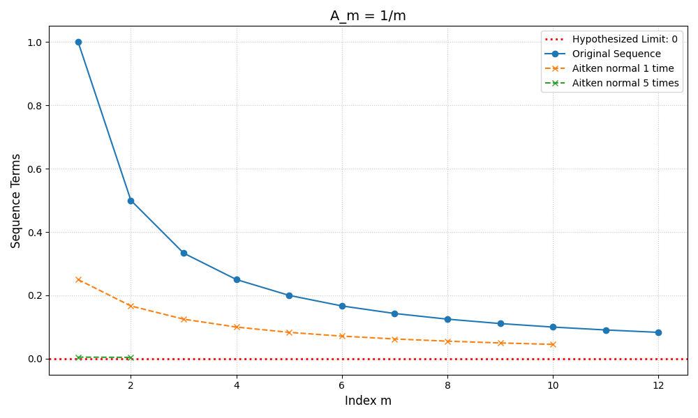
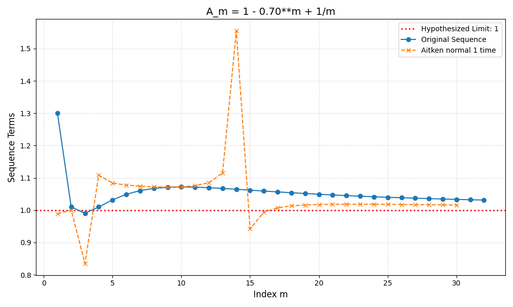
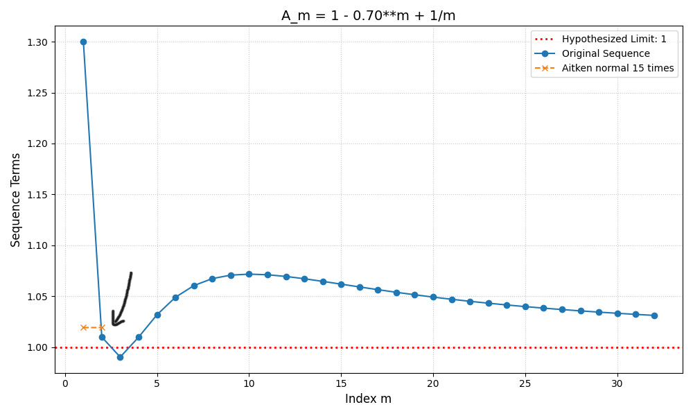
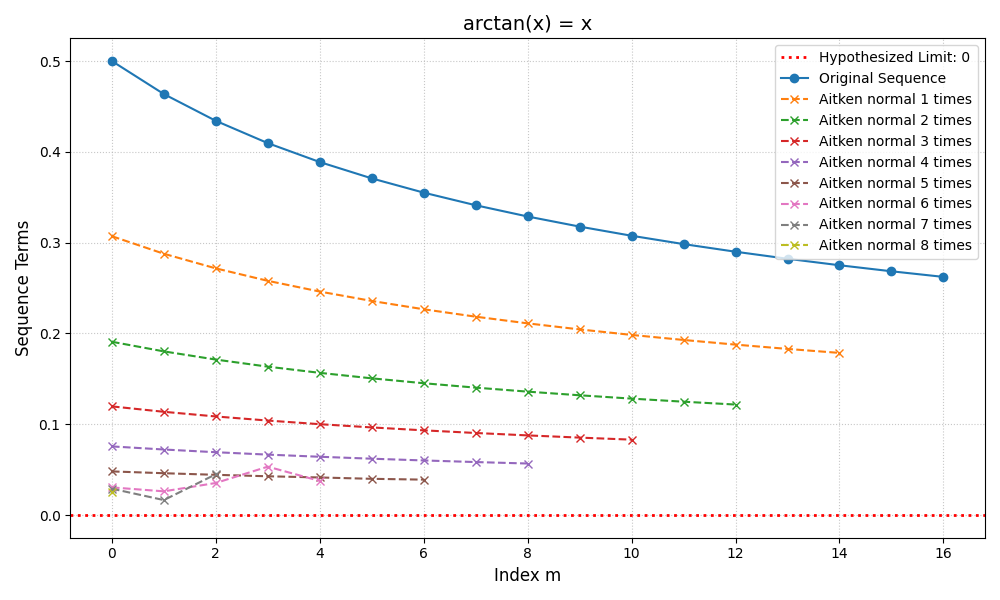

# Implementation of the Aitken-delta-square-mathod to accelerate convergence of sequences

## Overview

This project implements the Aitken-delta-square-mathod in order to show it accelerates the convergence of some explicit and recursive sequences and series.

The interactive visualization enables direct comparison of the original sequence with the Aitken-sequences with a slideshow that can be easily configured when using the class.


## Aitkens-delta-squared-method

It can be shown that, if a sequence $A_m$ converges linearily to the limit $A \in \mathbbm{R}$, the Aitken-delta-square-sequence 
$$ \hat{A}_m \coloneq A_m - \frac{(\delta A_m)^2}{\delta^2 A_m}$$
with
$$ \delta A_m \coloneq A_{m+1} - A_m, \quad \delta^2 A_m \coloneq \delta(\delta A_m) $$
converges against the same limit $A$ quicker in the sence that $\hat{A}_m - A = o(A_m - A) .$

## Implementation

The method is implemented in a class `Sequence_Aitken`, which manages the computation of the original sequence, the Aitken-delta-square-method and the visualiziation of the results.

The version of the Aitken-method for explicit sequences applies the formula mentioned above iteratively on the original sequence and all the emerging sub-sequences until there are not enough terms in the sequences anymore to compute a new sub-sequence.

For recursive sequences you can apply the same method as for explicit sequences, but there is an additional variation of the Aitken-method for fixed-point problems that uses three values of the recursive sequence to calculate a better one with the Aitken-formula and then use that value as the initial value for the next three recursive steps and so on.

The visualization compares the original sequence with the Aitken-sequences and, if hand over, the real limit of the sequence. This way it is easy to verify if the iterative Aitken-delta-square-method accelerates the convergence of the given sequence. It is possible to create slides with different parameters that manage the visual output of the results. The left and right arrow keys have to be pressed to switch between slides.


## Results

Sequences that converge linearily will converge faster with the AItken-delta-square-method, this can be shown by proof, and the implementation replicates that behaviour.

Non-linear convergent sequences on the other hand show mixed behaviour. Some of them converge faster with the Aitken-method, some show unexpected behaviour like big spikes way out of the bounds of the original sequence or numerical problems due to division with a really small denominator.

### Gallery

**Working sequences**

$ A_m = \frac{1}{m}$

The first iteration of the Aitken-method is already closer to the limit than the original sequence. The third iteration is so close to the limit that the lines start to overlap.

$ x = \cos(x) $
.png)
The fixed-point iteration with the Aitken-method is much closer to the limit than the recursive sequence.

**Problematic sequences**

$ A_m = 1 - 0.7^m + \frac{1}{m} $

There are a lot of spikes, but the Aitken-method seems to converge a little faster in the end.

Plotting the last Aitken-sequence shows that the comvergence is not that much faster and does not justify the additional calculation time.

$ x = \arctan(x) $

It converges to the limit at first, but encounters numerical problems when it gets closer to it.

$ x = \cos(\frac{1}{x}) $
normal.png)
The basic Aitken-method intensifies the chaotic jumps.
fixed_point.png)
In contrast the recursive Aitken-method converges to a fixed-point much faster than the original series.


## How to test it yourself

1. Install the required dependencies:

   ```bash
   pip install matplotlib
   ```

2. Import the implementation:

   ```python
   from aitken_method import Sequence_Aitken
   ```

3. Create a sequence object. For example, for the fixed-point iteration of $ x = \cos(x) $:

   ```python
   from math import cos

   seq = Sequence_Aitken(
       A=cos,
       lim=0.7390851332151606,
       min_m=0,
       max_m=20,
       rec=True,
       x_0=1.0
   )
   ```

4. Generate the accelerated sequences:

   ```python
   seq.set_aitken_normals()
   seq.set_aitken_fixedpoint()
   ```

5. Inspect the results:

   ```python
   print(seq)
   ```

6. Visualize the convergence interactively:

   ```python
   slides = [
       # [title, show limit, show original sequence, normal Aitken*, recursive Aitken]
       # * 0: All, 1: first and last, 2: last, 3: first
       ["cos(x) = x", True, True, -1, False],
       ["cos(x) = x", True, True, 0, False],
       ["cos(x) = x", True, True, -1, True]
   ]

   seq.show_slides(slides)
   ```